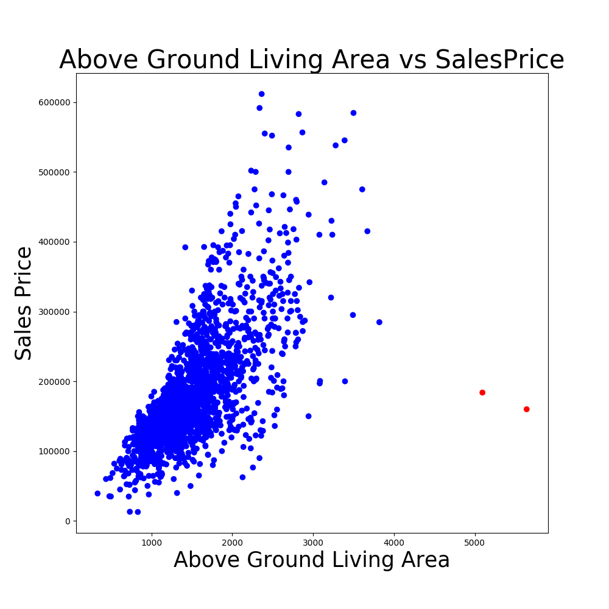
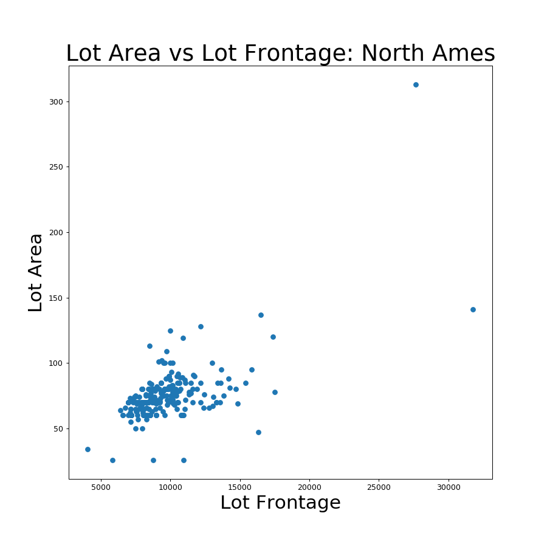
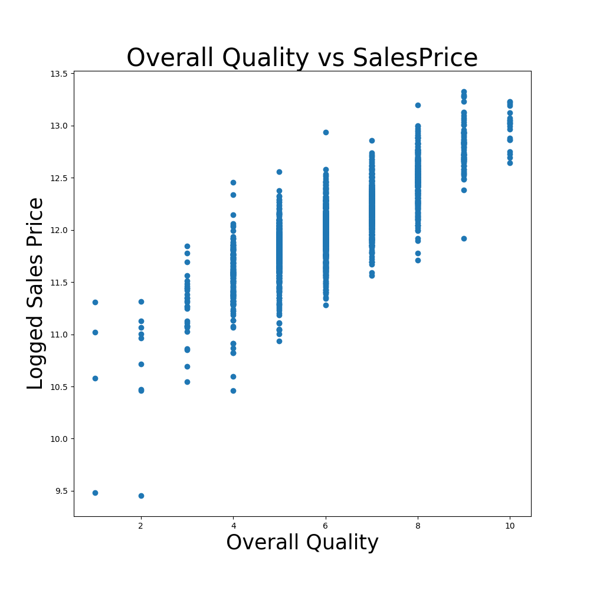
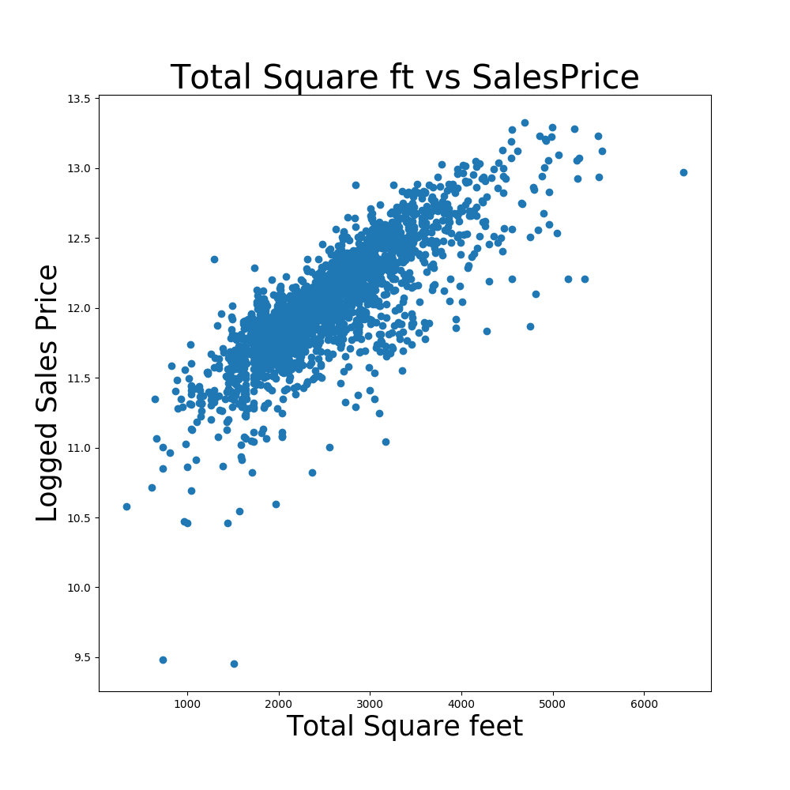

# The Problem

You are tasked with creating a regression model based on the Ames Housing Dataset. This model will predict the price of a house at sale. We need to review the different factors and consider what are the best predictors of price and create a model that will predict price from these predictors.

# Exploratory Data Analysis

## Checking for outliers
The codebook says this: "There are 5 observations that an instructor may wish to remove from the data set before giving it to students (a plot of SALE PRICE versus GR LIV AREA will indicate them quickly). Three of them are true outliers (Partial Sales that likely don’t represent actual market values) and two of them are simply unusual sales (very large houses priced relatively appropriately)." To check if those existed in our data set.

We can see that in the training set there are 2 outliers. For Modeling purposes we are going to remove these as leaving the means we will likely overfit our data to those outfitters.

## Checking for Nulls
|Feature|Number of Null Values|
|---|---|
|Pool QC |2042
Misc Feature|      1986
Alley|             1911
Fence |            1651
Fireplace Qu|      1000
Lot Frontage |      330
Garage Finish |     114
Garage Cond    |    114
Garage Qual     |   114
Garage Yr Blt    |  114
Garage Type|        113
Bsmt Exposure|       58
BsmtFin Type 2|      56
BsmtFin Type 1 |     55
Bsmt Cond       |    55
Bsmt Qual        |   55
Mas Vnr Type      |  22
Mas Vnr Area       | 22
Bsmt Half Bath      | 2
Bsmt Full Bath       |2
Garage Cars|          1
Garage Area |         1
Bsmt Unf SF  |        1
BsmtFin SF 2  |       1
Total Bsmt SF  |      1
BsmtFin SF 1    |     1

We can see that there are quite a few null values in the system. A review of the codebook suggest that many of them are due to features having NA as one of the categories. NA in the code book meant that this feature did not exist in the house. These will be converted to 0 for the numeric features and "No Feature" in the categorical features.

### Nulls that require special attention.
#### Basement
Based on what NA should mean in the dataset all of the basement nulls should be the same. This means that we need to identify what is going on with the 3 extra Nulls in Exposure and BsmtFin Type 2. A review of the data and codebook suggest that it was likely entry error. Since we do not know we are going to fill the house that have a basement but are null for those two features with Unknown. The rest of the nulls (55) will be filled with 0 or no basement.

#### Lot Frontage
Lot Frontage has a statistically significant number of nulls but doesn't have an explained reason for them in the codebook.
*theories*
1. All Alley plots
    * If we filter to only null Lot Frontage properties we only find 8 properties with Alleys
2. All Condos
    * If we filter to only null Lot Frontage properties we see that subclass with the most nulls is '1-STORY 1946 & NEWER ALL STYLES' (131 ) so they can not all be condos.

Since neither of these theories are evident in this dataset we need to assume that there is some entry error issue and we need to fill something in for our model to be correct for this feature.

*Modeling to see which feature is best for predicting Lot Frontage*
I felt like there were a number of factors that might be most interesting predictor for lot frontage. So I made a lasso regression that compared 'Lot Frontage','Lot Area','MS Zoning','Lot Shape','Lot Config', and 'Neighborhood'.

|Variables|	Coefficient	|Absolute Coefficient|
|--|--|--|
Lot Area	|11.720041	|11.720041
Lot Config_CulDSac	|-7.334338	|7.334338
Lot Config_Inside	|-4.910429|	4.910429
Neighborhood_NridgHt|	2.925914	|2.925914
Lot Config_FR2	|-2.865836	|2.865836
MS Zoning_RL	|2.278753|	2.278753
Neighborhood_BrDale	|-2.249133	|2.249133

Based on these results I decided to model on Lot Area and Neighbor hoods because I decided that since some neighborhoods were highly correlated and Lot area was the most correlated that these would be the best to create a model on to predict.

When comparing lot area to to lot frontage we can see that there is a pretty linear relationship between the two factors. So I created a linear regression to predict the lot frontage for the null entries from those properties neighborhood and lot area.

## Other EDA
### Making numeric columns that are actually categorical categorical.
I converted Month Sold, Year Sold, Year Built, Year Remod/Add and MS SubClass to strings since they are numbers but they numbers represent a category.

### Making Categorical columns numerical.
Exter Qual, Exter Cond, Bsmt Qual, Bsmt Cond, Heating QC, Kitchen Qual, Fireplace Qu, Garage Qual, Garage Cond, and Pool QC were all strings that represented a rating system. I decided to convert these to numeric for the model.

## Polynomial features
### Total Sq_Ft
I felt that the total sq_ft of a property is a better predictor of price then the sq_ft separated. I created a new column that added the Gr liv area, Total Bsmt SF, and Low Qual Fin SF and removed the columns from the model.
### Beds/Bath
Since number of beds and baths are pretty correlated to each other I added all the bedroom and bath number together and removed those columns from the model.

# Model

I modeled with all of the features excepting ID and PID and the columns I created polynomial columns with. I logged the sales price to normalize the positive skew.

## Testing Different Regressions:

|Model||Train Mean $R^2$ Cross Validation Score|Test Mean $R^2$ Cross Validation Score|                     
|---|---|---|---|

Linear Regression| 0.8133704951213396| -2.3095636116604097e+24
Ridge| 0.8694471822974466| 0.8894839236058634
Lasso| 0.816642057611101| 0.902819519448052
Elastic Net|0.039712571747666514| -0.004322360854397944

The lasso model preformed the best giving us a 90% explained variance in the test set.

I found that Overall Quality and total square feet were the best indicators for sales price in my test. We also can see that there is high correlation with the Kitchen quality, Concrete foundation and Number of cars the Garage can handle.

|Variables|	Coefficient	|Absolute Coefficient|
|--|--|--|
Overall Qual|	1.105678|	1.105678
Total_sq_ft	|1.097363|	1.097363
Overall Cond	|1.033749	|1.033749
1st Flr SF|	1.032398|	1.032398
2nd Flr SF	|1.030449	|1.030449
BsmtFin SF 1	| 1.026886|	1.026886
Kitchen Qual	|1.023822	|1.023822
Foundation_PConc|	1.023740|	1.023740
Garage Cars|	1.022152|	1.022152

# Next Steps

More reviewing of the features. Perhaps drop or create more polynomial features. Rather than inputing the nulls as 0, unknown or with regression imput these values using random assignment. 
